# SOC Incident Report: DDoS / Traffic Flood Detection & Response

## Overview

This lab simulates a **Denial-of-Service (DoS) attack** originating from an attacker machine and demonstrates how it was:

- Detected using Suricata IDS
- Correlated and escalated in Wazuh SIEM
- Investigated from a SOC analyst perspective
- Automatically mitigated via active response (firewall block)

## Scenario

An attacker machine (Kali Linux) generates **high-frequency HTTP request**s against a web server (Ubuntu).

**Goal:**

- **Identify** abnormal traffic patterns
- **Detect** attack behavior via rule correlation
- Automatically **block** the attacker

## Lab Architecture

- Attacker: **Kali Linux** (`192.168.67.2`)
- Target: **Ubuntu Server** (`192.168.68.2:8080`)

**Detection Stack:**

- Suricata (network IDS)
- Wazuh (SIEM + response)

### Step 1 — Attack Simulation

A DoS-like flood was generated using multiple concurrent `curl` loops:
```
for i in {1..50}; do while true; do curl http://192.168.68.2:8080; done & done
```
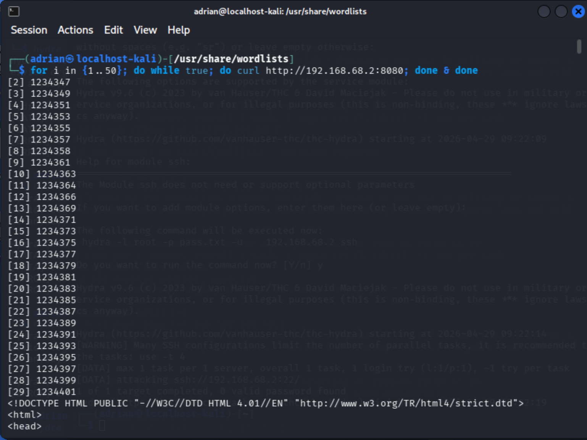

### Step 2 — Network Detection (Suricata)

Suricata captured HTTP traffic in real-time:

```
sudo tail -f /var/log/suricata/eve.json | jq 'select(.event_type=="http")'
```

**Key Observations:**
- **Repeated requests** from a single source IP
- **Same destination** (`port 8080`)
- High request frequency

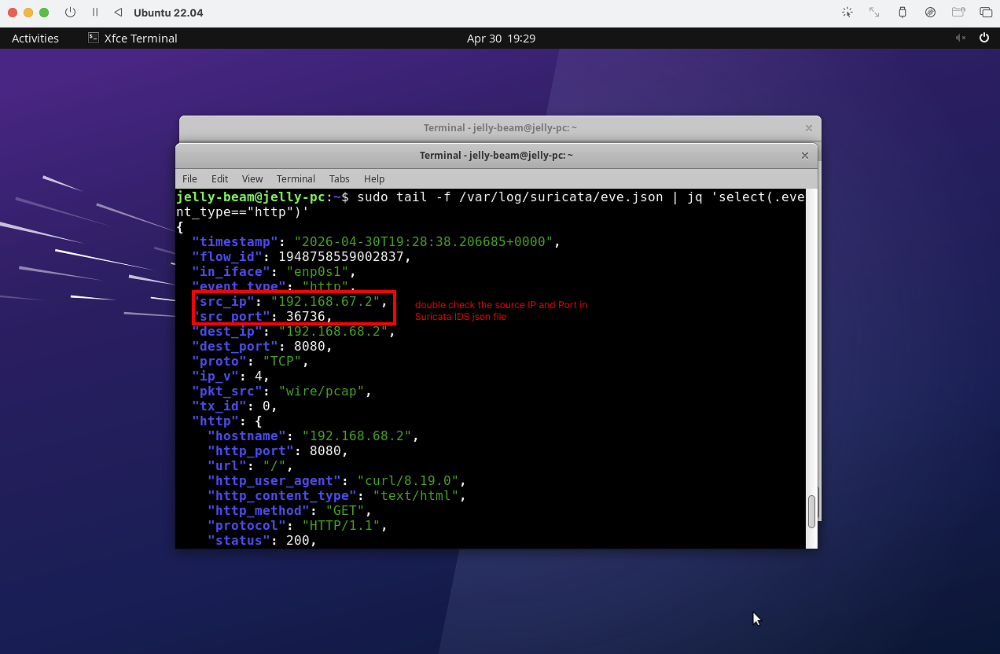

### Step 3 — SIEM Detection (Wazuh Rules)

- Rule 100500 — **HTTP Traffic Detection**

```
<rule id="100500" level="5">
  <if_group>suricata</if_group>
  <description>HTTP traffic detected</description>
  <group>network,http,</group>
</rule>
```

- Rule 100501 — **DoS Detection** (Correlation Rule)

```
<rule id="100501" level="12" frequency="50" timeframe="10">
  <if_matched_sid>100500</if_matched_sid>
  <same_source_ip/>
  <description>Possible DoS attack - high request rate detected</description>
  <mitre>
    <id>T1498</id>
  </mitre>
  <group>dos,network,</group>
</rule>
```

Screenshot: Wazuh rule configuration
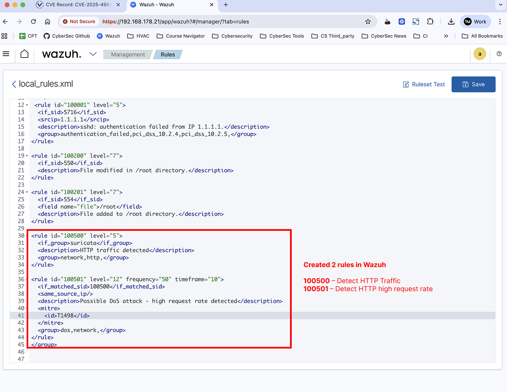

### Step 4 — Alert Triggering

**Initial Detection:**
-> Rule 100500 triggered repeatedly

Screenshot: HTTP traffic alerts
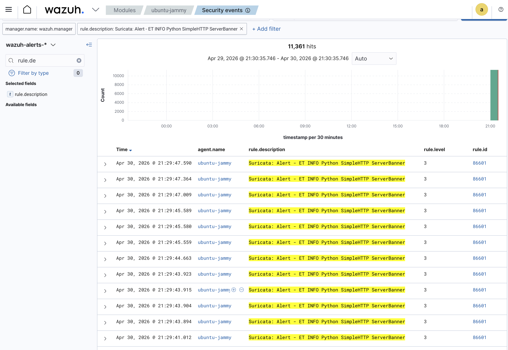

**Correlated Detection:**
-> Rule 100501 triggered after threshold exceeded

Screenshot: Rule triggered in logs
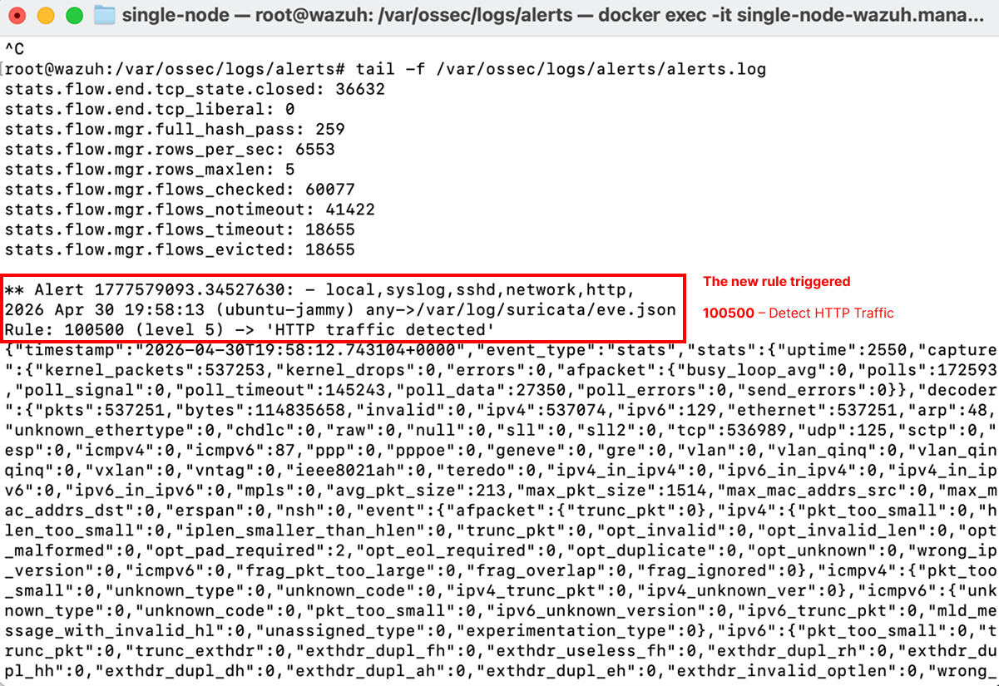

Screenshot: Wazuh dashboard alerts
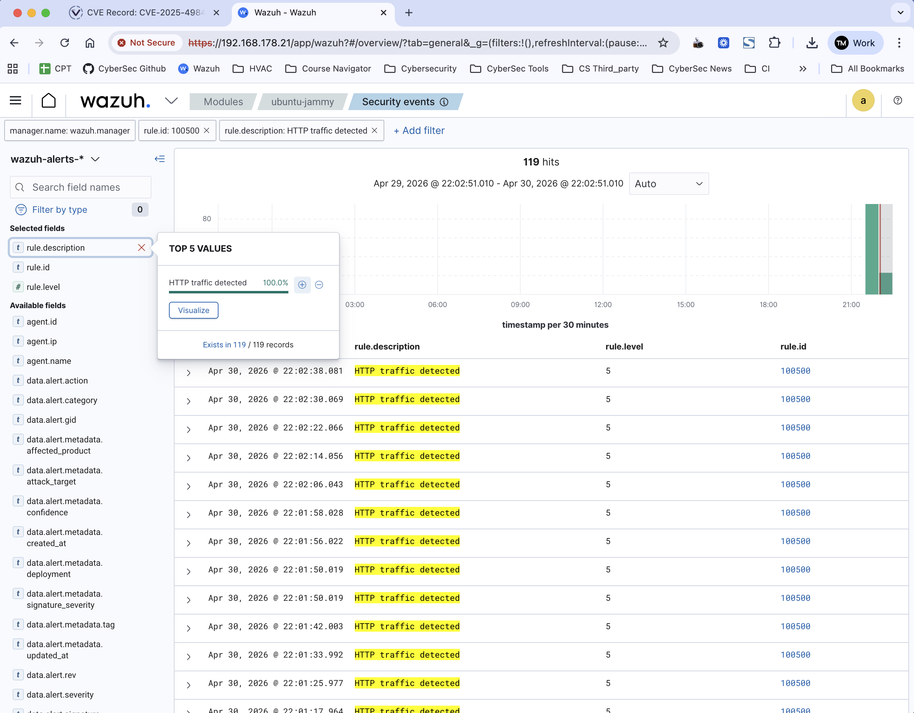

### Step 5 — Investigation (SOC Analysis)
**Indicators of Compromise (IoCs):**
- Source IP: `192.168.67.2`
- High request frequency
- Repeated identical HTTP requests
- Same destination service

**Analyst Reasoning:**
This behavior indicates:

- Automated traffic (non-human)
- Resource exhaustion attempt
- Pattern consistent with **DoS** (`MITRE T1498`)

### Step 6 — Active Response (Automated Blocking)
**Configuration:**
```
<active-response>
  <command>firewall-drop</command>
  <location>local</location>
  <rules_id>100501</rules_id>
  <timeout>180</timeout>
</active-response>
```

Screenshot: Active response config
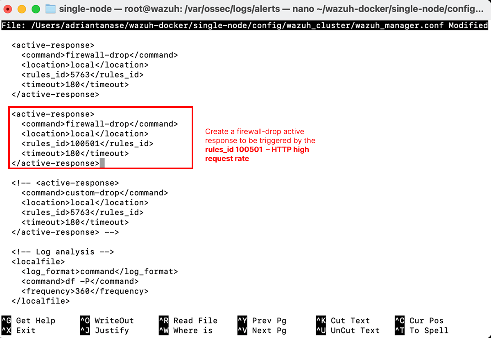

### Step 7 — Mitigation Verification
**Firewall Rule Applied (Active Response):**

```
iptables -L -n -v
```

**Result:**
- Attacker IP added to DROP rules

Screenshot: iptables drop rule
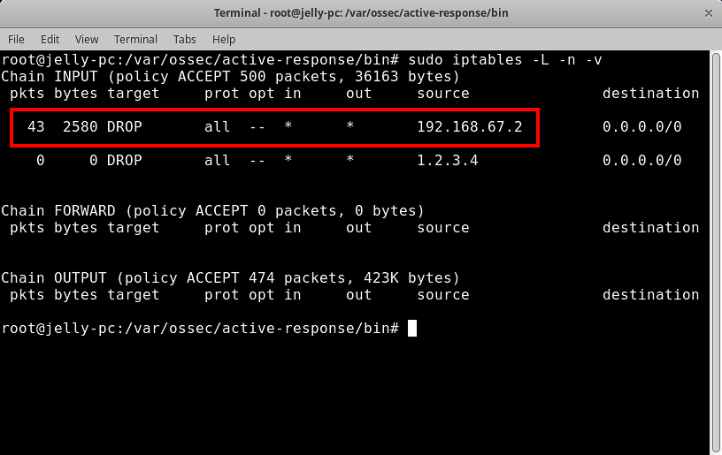

### Step 8 — Attack Block Confirmation
From attacker machine:
```
curl http://192.168.68.2:8080 -v
```
**Result:**
- Connection fails

Screenshot: attacker connection fails
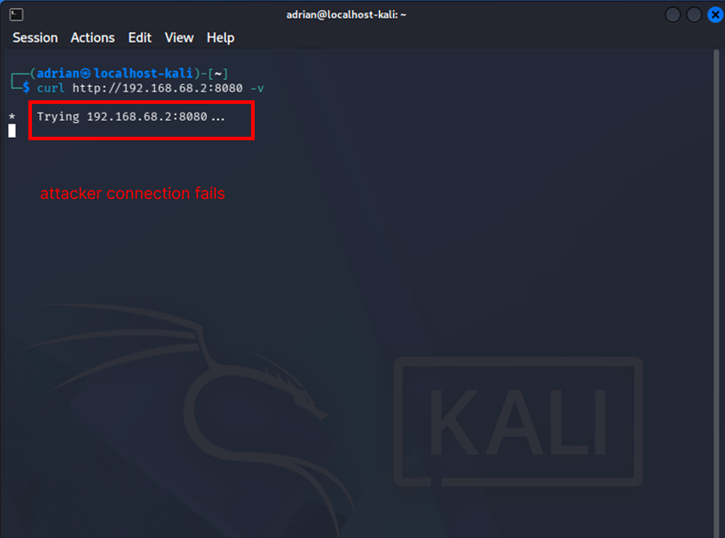

### Step 9 — SIEM Confirmation of Response
Wazuh logs confirm automated response execution:

Screenshot: Host blocked alerts
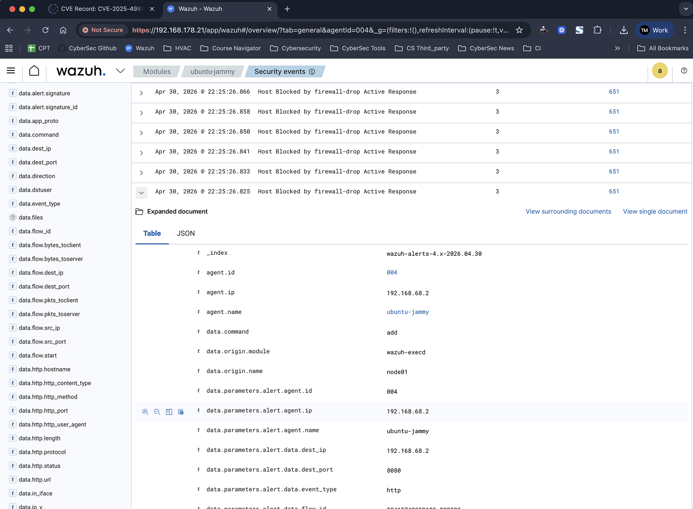
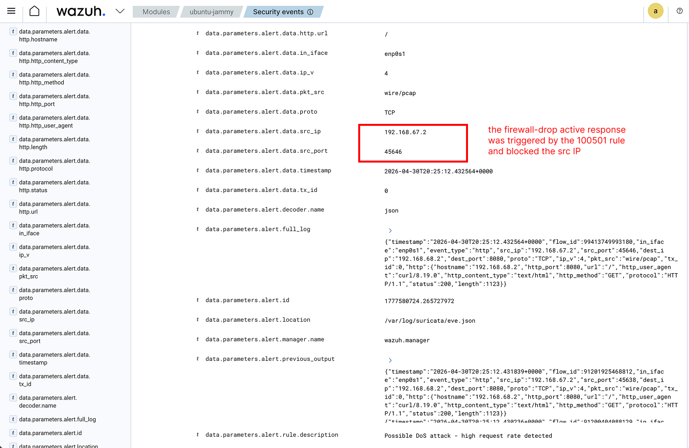


#### Challenges I Encountered & Troubleshooting

**Issue 1 — Rule 100501 Not Triggering**
- Cause: Threshold too low
- Fix: Increased frequency and adjusted timeframe
---
**Issue 2 — Active Response Not Triggering**
- Cause: Misconfiguration in rules_id
- Fix: Correct rule ID mapping
---
**Issue 3 — Firewall Script Not Working**
- default-firewall-drop failed to add iptables rule

**Root Cause:**
- Script execution issue / environment mismatch
  
**Workaround:**
-Manual validation using:
```
iptables -I INPUT -s <IP> -j DROP
```

