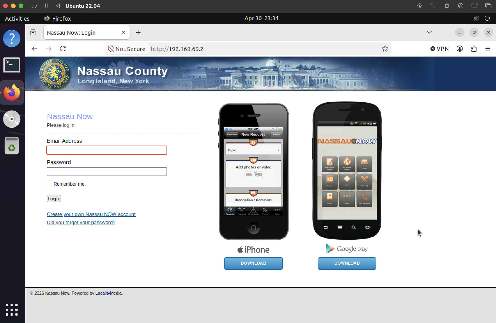
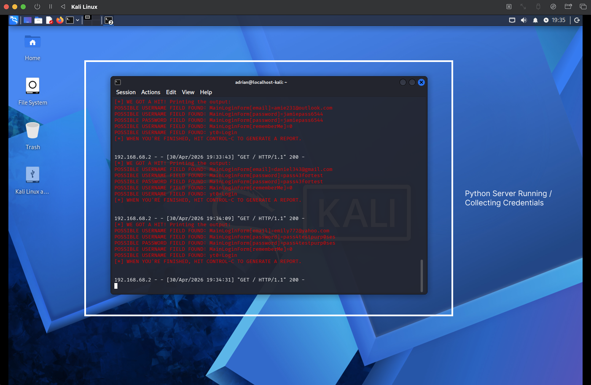
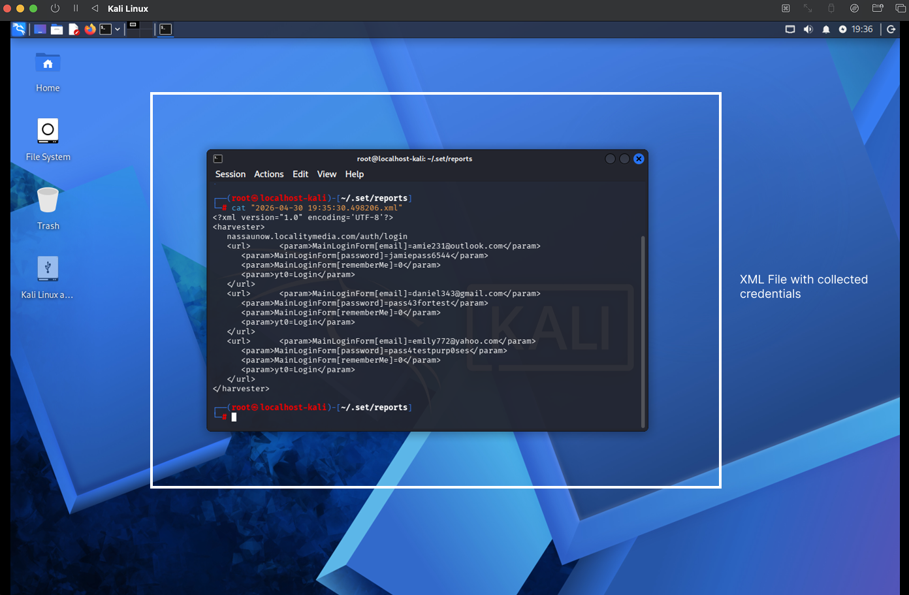
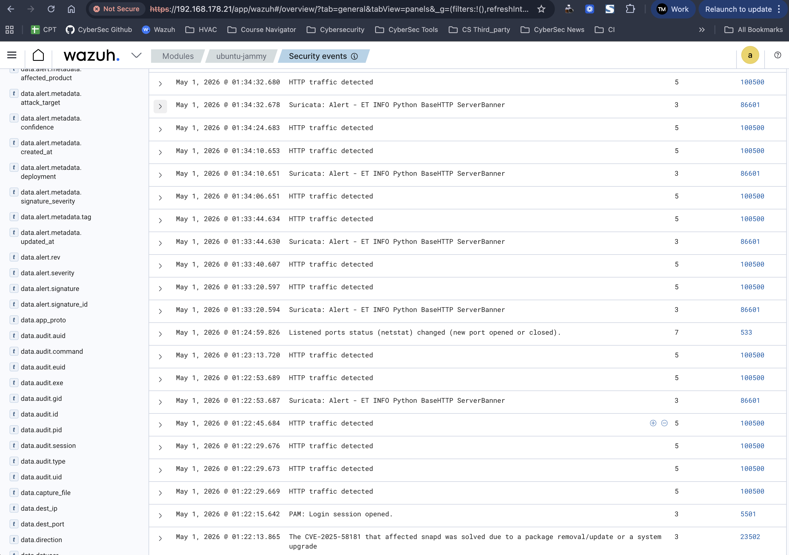
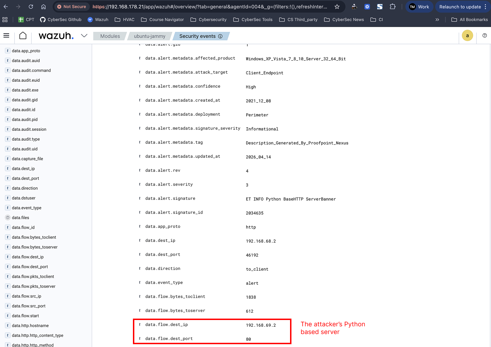

# Phishing Detection Lab with Wazuh (Behavior-Based Detection)

## 📌 Overview

This report documents the detection and investigation of a phishing attack simulated using the Social-Engineer Toolkit (SET), where an attacker successfully harvested user credentials via a fake login portal.

- A phishing page created with Social-Engineer Toolkit
- A Python-based credential harvesting server
- Custom Wazuh rules (behavior-based detection)
- Network monitoring via Suricata

The goal is to move beyond signature-based detection and identify attacker behavior patterns.

## Attack Scenario
1. A victim accesses a fake Nassau County login page
2. The attacker runs a Python HTTP server to collect credentials
3. Victim submits login details
4. Credentials are stored in an XML file
5. Wazuh detects:
    - Suspicious Python HTTP server
    - Credential submission via POST requests
    - Correlates events → flags phishing attack
---

| Component      | Role                                           |
| -------------- | ---------------------------------------------- |
| Kali Linux     | Attacker machine (SET + credential harvesting) |
| Ubuntu + Wazuh | SIEM + detection                               |
| Suricata       | Network IDS                                    |
| Victim Browser | Sends credentials                              |


### Step 1: Phishing Page (SET)

The phishing page was created using:

👉 Social-Engineer Toolkit (SET) → Credential Harvester Attack

- Cloned login page (Nassau County portal)
- Hosted locally on attacker machine
- Delivered over HTTP

Code: `sudo setoolkit`

Typical flow:
```
Social-Engineering Attacks
→ Website Attack Vectors
→ Credential Harvester Attack Method
→ Site Cloner
```

Hosted page: `http://192.168.69.2`



### Step 2: Credential Harvesting Server

SET automatically spins up a Python-based web server that captures credentials.

**Captured fields:**

- Email
- Password
- Form parameters



### Step 3: Stored Credentials
Captured credentials are saved in XML format:
```
<param>MainLoginForm[email]=example@email.com</param>
<param>MainLoginForm[password]=password123</param>
```


### Step 4: Wazuh Detection Rules

Custom rules were created to detect attack behavior.

**1. Detect Python HTTP Server (SET)**

```
<rule id="100001" level="6">
  <match>BaseHTTP</match>
  <description>Suspicious Python-based web server detected (SET)</description>
</rule>
```

**2. Detect Credential Submission**

```   
<rule id="100002" level="10">
  <match>POST</match>
  <description>HTTP POST request detected (possible credential submission)</description>
</rule>
```

**3. Correlate Attack (Phishing Confirmation)**

```
<rule id="100003" level="12">
  <if_sid>100001</if_sid>
  <if_sid>100002</if_sid>
  <description>Confirmed phishing attack (SET credential harvester)</description>
</rule>
```

### Step 5: Wazuh Alerts

Wazuh generates alerts based on behavior:

- Python BaseHTTP server detected (SET)
- HTTP traffic spikes
- POST credential submissions
- Correlated phishing alert





### Step 6: Network Evidence

Wazuh + Suricata logs reveal:

- Attacker IP: `192.168.69.2`
- Port: `80`
- Traffic type: `HTTP`
- Server type: `Python BaseHTTP (SET)`

***This confirms the phishing infrastructure.***

**Detection Logic Summary**

| Behavior              | Detection Method   |
| --------------------- | ------------------ |
| SET phishing server   | BaseHTTP signature |
| Credential submission | HTTP POST          |
| Attack confirmation   | Rule correlation   |


