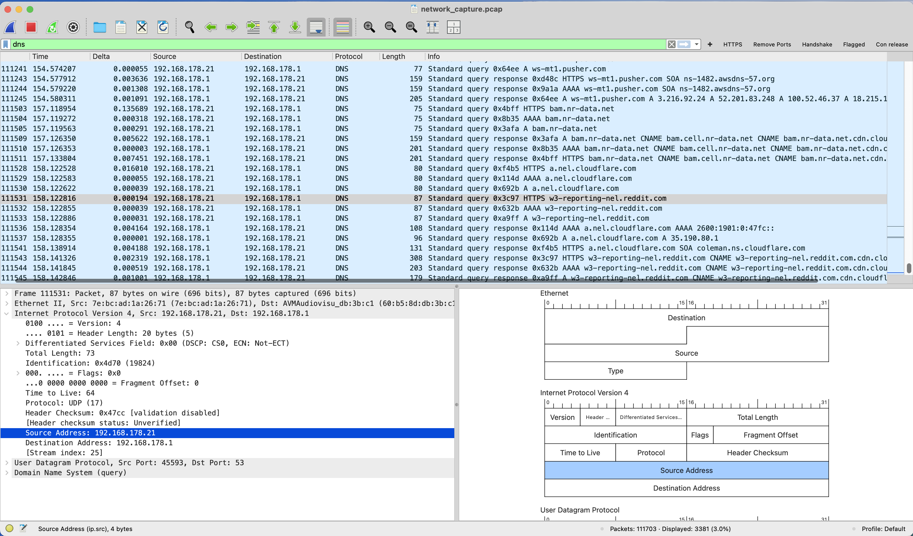
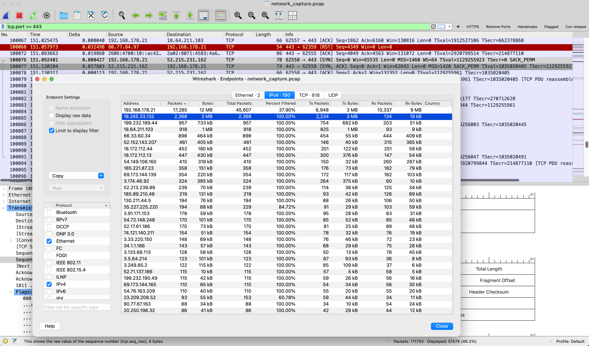
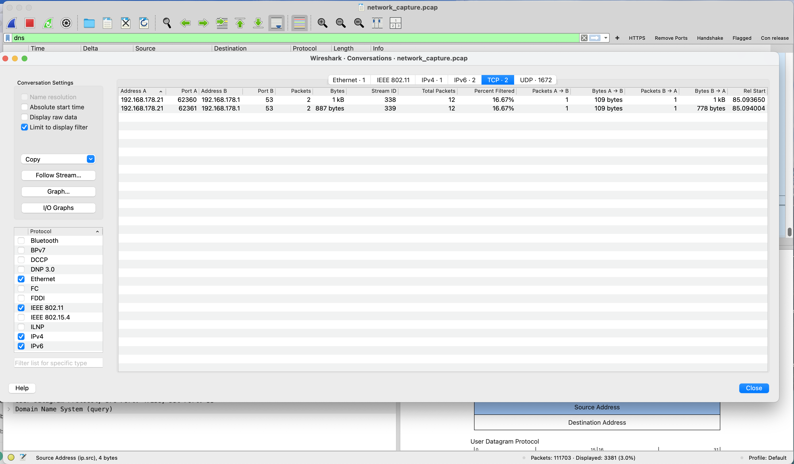

# Network Traffic Analysis Report (Wireshark)

## Overview
This project demonstrates hands-on **network traffic analysis** using real packet captures.  
The goal was to identify normal vs. suspicious behavior by analyzing DNS and HTTP traffic using Wireshark.

This simulates a real-world **SOC (Security Operations Center)** workflow:
- Capture traffic  
- Investigate patterns  
- Identify anomalies  
- Document findings  

---

## Objectives
- Capture live network traffic
- Analyze DNS and HTTP activity
- Identify top communicating IPs
- Detect potential suspicious patterns
- Produce a professional security report

---

## Tools Used
- Wireshark  
- macOS Terminal  
- PDF reporting  

---

## Methodology

### 1. Traffic Capture
- Captured live traffic on Wi-Fi interface (`en0`)
- Generated activity by browsing websites (Google, YouTube, Reddit)
- Duration: ~3–5 minutes

Saved file:
network_capture.pcap


---

### 2. Traffic Analysis

#### DNS Filtering



Analyzed:
- Domain queries  
- Frequency of requests  
- Resolution behavior  

---

#### HTTP Filtering

{HTML FILTERING IMAGE}


Analyzed:
- GET / POST requests  
- URLs  
- Unencrypted traffic  

---

### 3. Endpoint Analysis
Navigation in Wireshark:



Identified:
- Top talkers (highest packet counts)  
- Internal vs external communication  

---

## Key Findings

### Repeated DNS Queries
- Frequent queries to:
  - `pusher.com`
  - `reddit.com`
  - `cloudflare.com`

-> Likely normal application behavior, but similar patterns can indicate **malware beaconing**.

---

### Network Communication Flow
- Internal device (`192.168.x.x`) communicates mainly with:
  - Local gateway (`192.168.x.1`)



This is expected behavior in a home network.

---

### Traffic Distribution
- Majority of traffic routed through gateway  
- No suspicious direct external IP connections observed  

---

### HTTP Traffic Observed
- NO unencrypted HTTP traffic detected
  Good sign!
---

### Suspicious Pattern Assessment

| Indicator       | Status       | Notes                          |
|-----------------|--------------|--------------------------------|
| DNS Flooding    | Not observed | Normal frequency               |
| Unknown IPs     | Not observed | Trusted services               |
| Traffic Spikes  | Moderate     | Normal browsing behavior       |
| Plain HTTP      | Present      | Potential security risk        |

---

## Network Flow Diagram

```text
+-------------------+        +-------------------+        +----------------------+
|   Local Device    |        |      Router       |        |   External Internet  |
|  192.168.178.21   | -----> |  192.168.178.1    | -----> |  DNS / Web Servers   |
|   (My Mac)        |        |   (Gateway/NAT)   |        | (Cloudflare, etc.)   |
+-------------------+        +-------------------+        +----------------------+
        |                             |                              |
        | DNS Request                 | Forwards Request             |
        |---------------------------->|----------------------------->|
        |                             |                              |
        | DNS Response                | Returns Response             |
        |<----------------------------|<-----------------------------|
```
---

## Screenshots

### Traffic Analysis


### DNS Traffic Analysis


### Conversations (Traffic Flow)


### Top IP Endpoints


---

## Full Report
Download the full analysis report:

[Download PDF](Adrian_SOC_Network_Traffic_Analysis.pdf)

---

## Future Improvements
- Integrate threat intelligence (VirusTotal, AbuseIPDB)  
- Automate analysis using Python  
- Add anomaly detection logic  
- Simulate attack scenarios  

---

## Author
Adrian  
Aspiring SOC Analyst | Cybersecurity Enthusiast  
