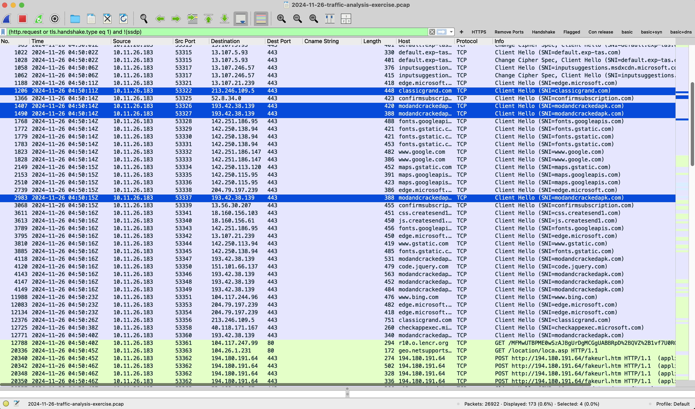
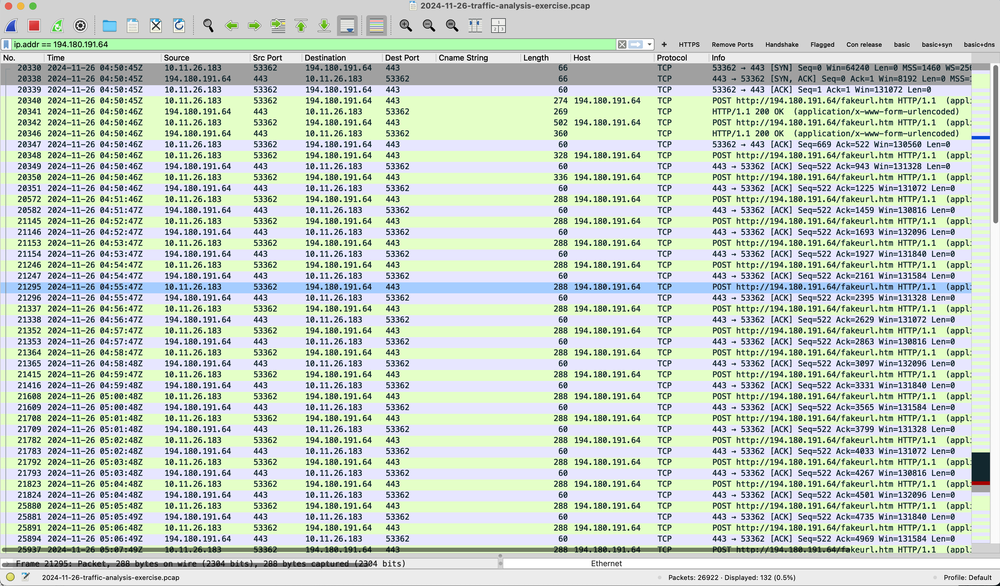
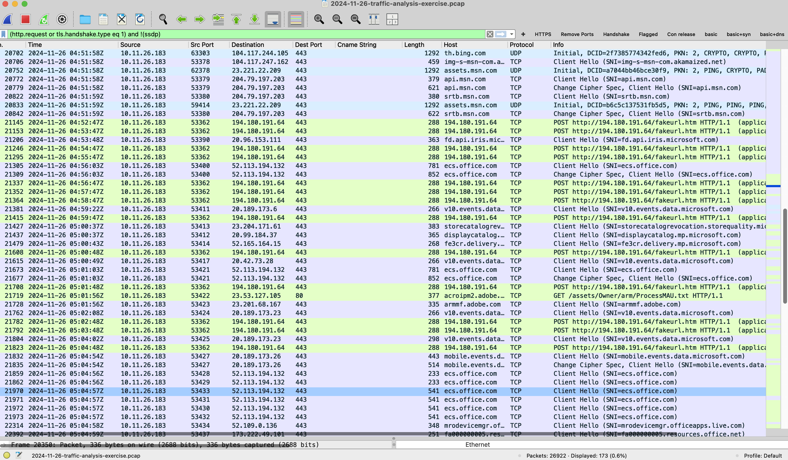
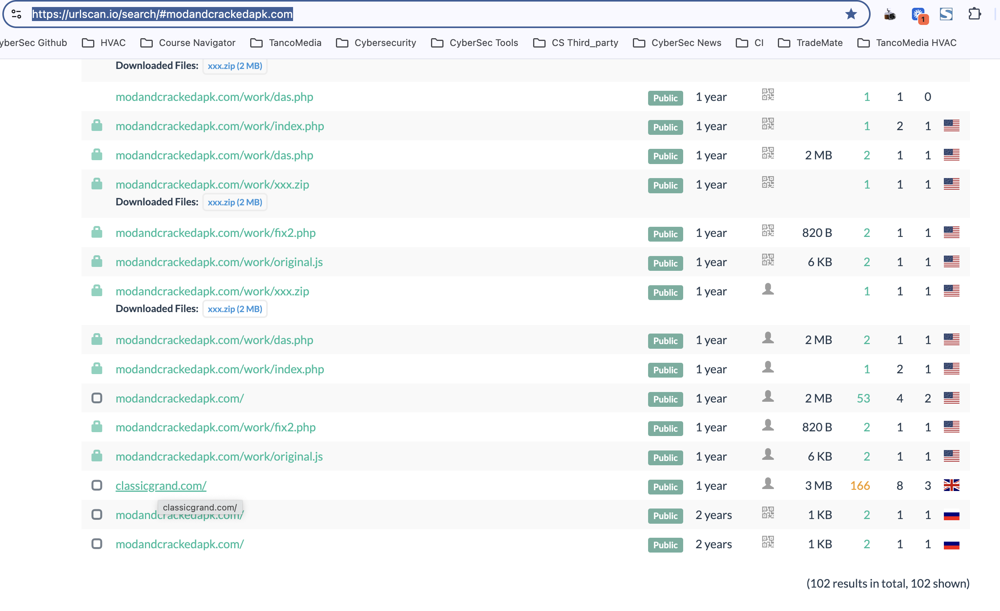
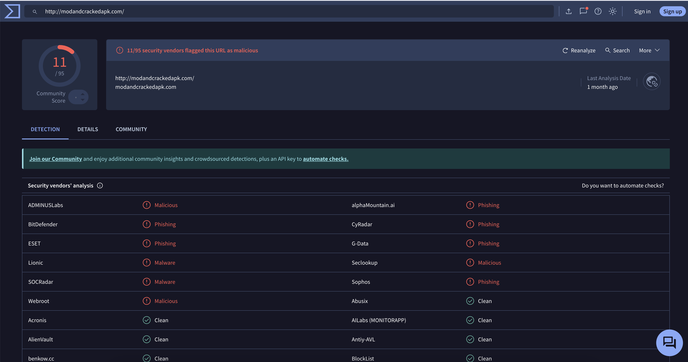

# NetSupport RAT Infection (PCAP Analysis)

SOC Analysis Report (doc) –> https://docs.google.com/document/d/1I0wC7qak-zpMqhASKPXZOrxcWFdKVDIdAPdELzTUXPY/edit?tab=t.0#heading=h.u0035c64e7i2 
Incident Report (doc) –> https://docs.google.com/document/d/1wWENVTgMMc6yfwKnVjzNbttczvI140y56Si2JZAZ_Bk/edit?tab=t.0

## Executive Summary

On **November 26, 2024 at ~04:50 UTC**, host `10.11.26.183` exhibited network behavior consistent with a NetSupport RAT infection.

The infection likely originated after the user accessed classicgrand.com, which **delivered malicious content via the SmartApeSG (fake browser update) campaign**, **redirecting to modandcrackedapk.com**.

Following this activity, the host initiated repeated HTTP POST requests over TCP 443 to `194.180.191.64`, a known malicious endpoint associated with **NetSupport RAT command-and-control (C2) communication**.

## Victim Details

| Field        | Value             |
| ------------ | ----------------- |
| IP Address   | 10.11.26.183      |
| Hostname     | DESKTOP-B8TQK49   |
| MAC Address  | d0:57:7b:ce:fc:8b |
| User Account | oboomwald         |
| Domain       | NEMOTODES         |
| Full Name    | Oliver Boomwald   |

## Step-by-Step Infection Analysis (Wireshark)

**1. Detect suspicious HTTP activity & Identify the Victim Host**
Filter used:
```
(http.request or tls.handshake.type eq 1) and !(ssdp)
```
High volume of outbound connections observed
Host stands out as most active internal system



--- 

Observed domains:
```
classicgrand.com
modandcrackedapk.com ⚠️
Microsoft / Google domains (normal baseline)
```

** Finding:**
- Multiple downloads and requests
- Suspicious file patterns and external communication
- User initially accessed classicgrand.com
- Shortly after, connections to modandcrackedapk.com

-> Indicates possible malicious redirect or injected script

**2. Identify Command-and-Control Traffic**

Filter used:
```
ip.addr == 194.180.191.64
```



--- 

Observed:

- Repeated HTTP POST requests
- Destination: `194.180.191.64`
- URI: `/fakeurl.htm`
- Traffic occurring over TCP port 443 (non-standard HTTP usage)

--- 

**Key Indicators:**
- Non-Standard Protocol Behavior
- HTTP traffic over port 443
- Not encrypted TLS → indicates evasion technique
- Repeated POST Requests
- High-frequency POST activity
- Consistent destination and URI

-> Strong indicator of **beaconing behavior**

---

**3. Beaconing Pattern Analysis**

**Observed characteristics:**

- Regular intervals of communication
- Same endpoint `/fakeurl.htm`
- Similar packet sizes



-> This pattern is consistent with:

**Malware periodically communicating with a C2 server**

---

**4. Validate Suspicious Domain (OSINT Analysis)**

```
Tool used: urlscan.io
Query: modandcrackedapk.com
```

- Searched the domain using urlscan.io:

**Identified association with:**
- SmartApeSG (fake browser update campaign)
- Known malware delivery infrastructure

**Finding:**
- Domain is not legitimate
- Frequently observed in malicious redirect chains
- Linked to payload delivery (NetSupport RAT) check https://www.proofpoint.com/us/blog/threat-insight/are-you-sure-your-browser-date-current-landscape-fake-browser-updates 
- Also linked to classicgrand.com (where the infection started)

-> Confirms that traffic observed in Wireshark is part of a known infection campaign




**5. Threat Intel Correlation**1. 

**URL Reputation Analysis (VirusTotal)**

The suspicious domain `modandcrackedapk.com` was analyzed using VirusTotal.

**Results:**
- 11 / 95 security vendors flagged the domain as malicious
  
**Classifications include:**
- Malware
- Phishing
- Malicious
  
**Interpretation:**

**Multi-engine detection confirms the domain is not benign**

Flags from vendors like:
- BitDefender
- ESET
- Sophos
- Webroot

-> This strongly supports that the domain is part of malicious infrastructure, likely used for:

- Malware distribution
- Payload delivery
- Command-and-control (C2)

**Conclusion:**

The domain `modandcrackedapk.com` was confirmed malicious via OSINT sources, including `VirusTotal (11/95 detections)` and `URLScan`, strengthening attribution to malicious infrastructure.

**Evidence:**



**6. The Infection Chain**

```
User visits classicgrand.com
↓
Injected script / redirect occurs
↓
Connection to modandcrackedapk.com (malicious)
↓
Fake browser update (SmartApeSG delivery)
↓
Execution of payload (NetSupport RAT)
↓
Host begins POST beaconing to 194.180.191.64
```
---

## Indicators of Compromise (IOCs)

IP Addresses:
```
194.180.191.64
```

Domains
```
modandcrackedapk.com
classicgrand.com
```

URLs
```
http://194.180.191.64/fakeurl.htm
```

Malware
```
NetSupport RAT
SmartApeSG (Fake Browser Update Campaign)
```

---

## Severity Assessment

| Metric     | Value                                      |
| ---------- | ------------------------------------------ |
| Severity   | 🔴 High                                    |
| Confidence | High                                       |
| Impact     | Active Remote Access Trojan (C2 confirmed) |

---

## Conclusion

Host `10.11.26.183` is confirmed compromised with NetSupport RAT, based on:

- Malicious domain interaction `modandcrackedapk.com`
- Infection chain from `classicgrand.com`
- Repeated HTTP POST beaconing to `194.180.191.64`
- Use of non-standard protocol behavior (HTTP over 443)

-> This represents an active command-and-control infection

### Recommended Actions:
- Isolate host `10.11.26.183`
- Perform full endpoint forensic analysis
- Reset credentials for user `oboomwald`
- Block all identified IOCs
- Investigate lateral movement

**Deploy SIEM detections for:**
- Beaconing
- HTTP over 443
- Known malicious domains

---

**Skills Demonstrated**
- Network traffic analysis (Wireshark)
- Malware infection chain analysis
- Beaconing detection
- Threat intelligence (OSINT via urlscan)
- IOC extraction
- SOC incident reporting
