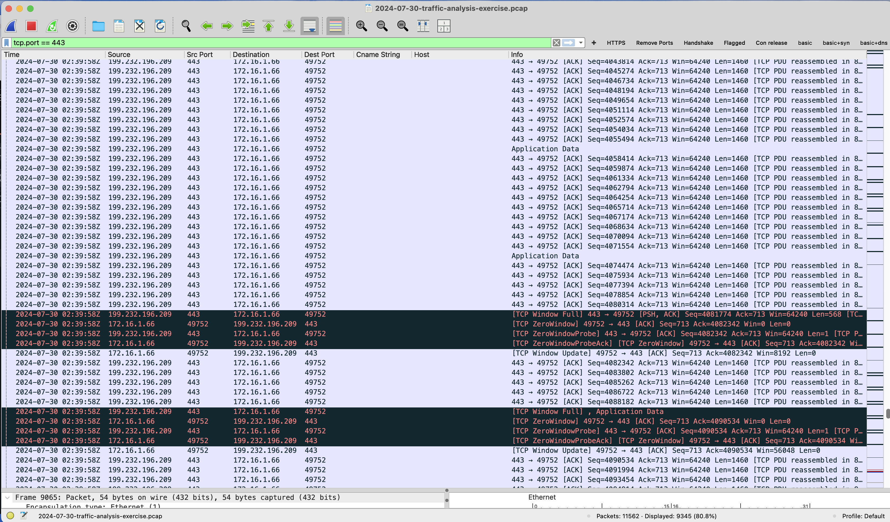
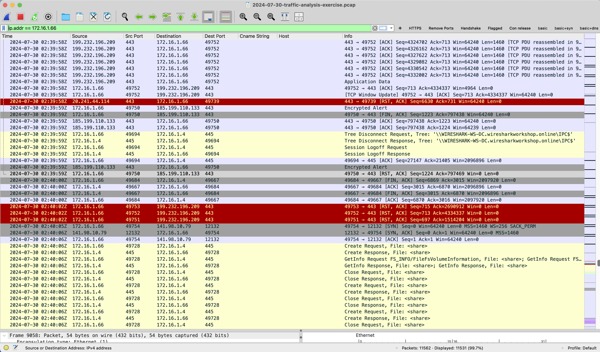
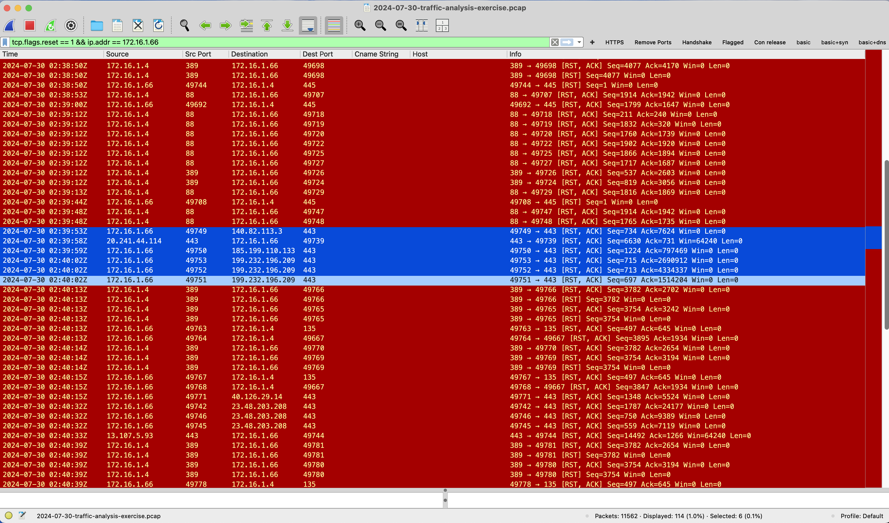
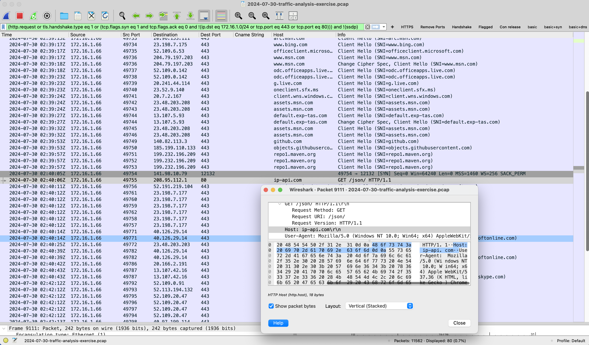
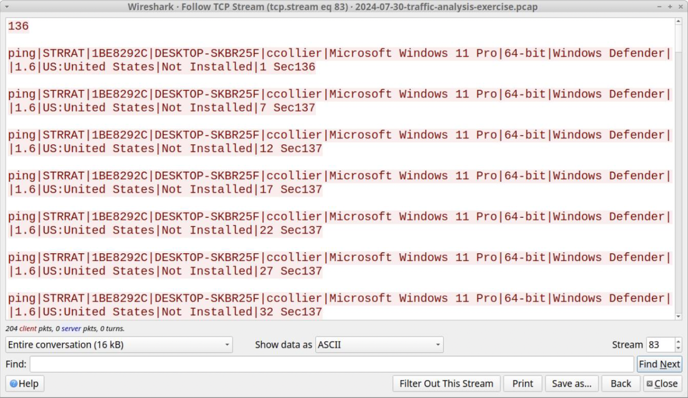

# SOC Incident Report: Suspected STRRAT Infection (PCAP Analysis/Investigation)
## Executive Summary

On July 30, 2024, host 172.16.1.66 exhibited suspicious network behavior consistent with a STRRAT (Java-based Remote Access Trojan) infection.

The host initiated multiple outbound TLS connections over TCP 443, followed by:

- High-frequency small packet transmissions (application data bursts)
- Rapid TCP RST packets to multiple external IP addresses
- No graceful TLS session termination (absence of FIN packets)

Shortly after, the host performed an unencrypted HTTP request to ip-api.com (port 80), a known technique used by malware to retrieve geolocation data.

Further analysis of TCP streams revealed cleartext beaconing traffic containing the string STRRAT, confirming active command-and-control (C2) communication.

| Field            | Value                 |
| ---------------- | --------------------- |
| Hostname         | DESKTOP-SKBR25F       |
| IP Address       | 172.16.1.66           |
| MAC Address      | Not observed in PCAP  |
| User Account     | ccollier              |
| Operating System | Windows 11 Pro 64-bit |
| Security         | Windows Defender      |

## Technical Findings

## 1. Suspicious TLS Traffic Patterns
- Multiple small TCP packets labeled "Application Data"
- Packets transmitted within milliseconds of each other
- Indicates beaconing behavior or staged communication



Wireshark TLS traffic showing repeated small packets

## 2. Rapid RST Burst to External IPs
Multiple TCP RST, ACK packets within ~1 second
External IPs targeted:
```
199.232.196.209
185.199.110.133
20.241.44.114
```

## Interpretation:

- Failed or rotating C2 infrastructure
- Malware fallback connection logic
- Abnormal termination behavior





## 3. No Graceful TLS Shutdown
Expected behavior: FIN/ACK termination
Observed behavior: RST termination only

➡️ Indicates non-standard session handling typical of malware

## 4. HTTP Request to Geolocation Service
Outbound request to:
- Domain: ip-api.com
- Port: 80 (unencrypted)

Example:

GET /json/ HTTP/1.1

### Host: 
- ip-api.com

### Purpose:
- Retrieve victim geolocation
- Adapt malware behavior
- Report system metadata



## 5. Confirmed STRRAT Beaconing

TCP stream revealed:

```
ping|STRRAT|1BE8292C|DESKTOP-SKBR25F|ccollier|Microsoft Windows 11 Pro|64-bit|Windows Defender|1.6|US:United States|Not Installed
```

Key observations:

- Repeated "ping|STRRAT" messages

### Includes:
- Hostname
- Username
- OS version
- Security status
- Geographic location

➡️ Definitive evidence of STRRAT infection and C2 beaconing



## 6. SMB Activity Post-Network Event

Internal SMB traffic between:
- **172.16.1.66 ↔ 172.16.1.4**

Observed:
- **Access to IPC$ and SYSVOL**
  
File queries:
- **desktop.ini**
- **autorun.inf**

### Assessment:

- No malware file transfer detected
- Likely normal domain activity or minor reconnaissance

## Indicators of Compromise (IOCs)
### IP Addresses
```
199.232.196.209
185.199.110.133
20.241.44.114
141.98.10.79
208.95.112.1
```

### Domains
- ip-api.com

### URLs
- http://ip-api.com/json

### Malware Identifier
- STRRAT

### File Hashes
- No binaries extracted from PCAP
- SHA256 unavailable

## Severity Assessment

| Metric     | Value                                      |
| ---------- | ------------------------------------------ |
| Severity   | 🔴 High                                    |
| Confidence | High                                       |
| Impact     | Active Remote Access Trojan (C2 confirmed) |


### MITRE ATT&CK Mapping
- T1071.001 – Web Protocols
- T1041 – Exfiltration Over C2
- T1105 – Ingress Tool Transfer

## Conclusion

Host 172.16.1.66 is confirmed to be infected with STRRAT malware, based on:

- Cleartext **STRRAT beaconing traffic**
- Suspicious **TLS communication patterns**
- **Rapid RST bursts** to external infrastructure
- **Geolocation lookup** via ip-api.com

### This represents an active compromise with ongoing command-and-control communication

## Recommended Actions
- Isolate host 172.16.1.66 from the network
- Perform full endpoint forensic analysis
- Reset credentials for user **ccollier**
- Block all identified IOCs at network perimeter
- Investigate potential lateral movement
- **Deploy EDR/SIEM detection rules** for STRRAT activity

## Detection Rules (Splunk)

### Detect RST Burst Behavior
```
index=network sourcetype=pcap
| where tcp_flags="RST"
| stats count by src_ip, dest_ip
| where count > 10
```

### Detect Beaconing (Small Packets)
```
index=network
| stats avg(bytes) as avg_bytes count by src_ip, dest_ip
| where avg_bytes < 200 AND count > 50
```

### Detect ip-api Requests
```
index=network http_host="ip-api.com"
| stats count by src_ip, uri
```

### Detect STRRAT Signature
```
index=network
| search "STRRAT"
```

### Detect Abnormal TLS Termination
```
index=network
| stats count(eval(tcp_flags="FIN")) as fin_count 
        count(eval(tcp_flags="RST")) as rst_count 
        by src_ip
| where rst_count > fin_count
```

## Conclusion

- Host **172.16.1.66** is confirmed **compromised**

**Evidence includes:**

- STRRAT beaconing traffic
- TLS anomalies
- RST burst patterns
- External reconnaissance behavior

### This represents an active malware infection with C2 communication

## Skills Demonstrated
- Network traffic analysis (Wireshark)
- TCP/TLS behavior analysis
- Malware beacon detection
- IOC extraction
- SOC incident reporting
- Threat correlation
